# Apollo教程

教程纲要：

- 理解配置中心的概念和使用场景
- 了解主流配置中心
- 理解Apollo的功能特性
- 掌握Apollo的快速入门
- 理解Apollo的工作原理
- 安装Apollo
- 理解Apollo的核心概念
- 掌握Apollo的项目管理方法
- 掌握Apollo的配置管理方法
- 掌握Apollo集群管理方法
- 理解Apollo的配置发布原理
- 掌握SpringBoot 集成Apollo的使用方法
- 掌握Apollo生产环境的部署方法
- 掌握Apollo灰度发布的方法

# 📖1.Apollo简介

## ✅1.什么是配置

程序在启动和运行的时候往往需要读取一些配置信息，配置基本上伴随着应用程序的整个生命周期。比如：数据库连接参数、启动参数等。

配置主要有以下几个特点：

- **配置是独立于程序的只读变量**

- **配置伴随应用的整个生命周期**

  - 配置贯穿于应用的整个生命周期，应用在启动时通过读取配置来初始化，在运行时根据配置调整行为。

  - 比如：启动时需要读取服务的端口号、系统在运行过程中需要读取定时策略执行定时任务等。

- **配置可以有多种加载方式**
  - 常见的有程序内部硬编码，配置文件，环境变量，启动参数，基于数据库等
- **配置需要治理**
  - 权限控制：由于配置能改变程序的行为，不正确的配置甚至能引起灾难，所以对配置的修改必须有比较完善的权限控制
  - 不同环境、集群配置管理：同一份程序在不同的环境（开发，测试，生产）、不同的集群（如不同的数据中心）经常需要有不同的配置，所以需要有完善的环境、集群配置管理

## ✅2.什么是配置中心

> 背景：
>
> 传统单体应用存在一些潜在缺陷，如随着规模的扩大，部署效率降低，团队协作效率差，系统可靠性变差，维护困难，新功能上线周期长等，所以迫切需要一种新的架构去解决这些问题，而微服务（ microservices ）架构正是当下一种流行的解法。
> 不过，解决一个问题的同时，往往会诞生出很多新的问题，所以微服务化的过程中伴随着很多的挑战，其中一个挑战就是有关服务（应用）配置的。当系统从一个单体应用，被拆分成分布式系统上一个个服务节点后，配置文件也必须跟着迁移（分割），这样配置就分散了，不仅如此，分散中还包含着冗余，如下图：
>
> 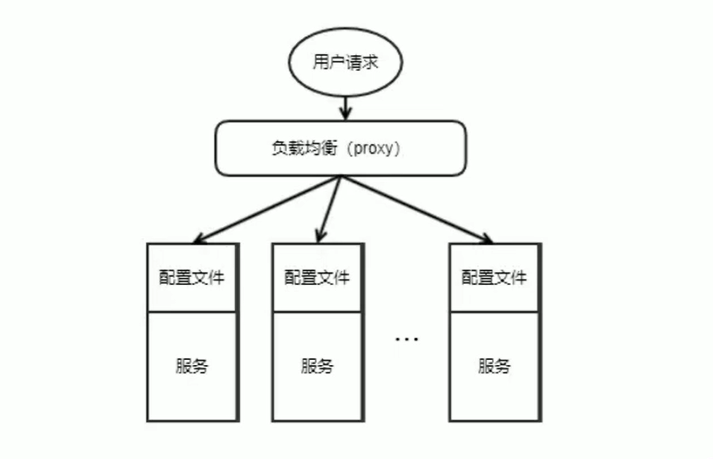

**配置中心是微服务架构中的一个核心组件，作用是统一管理分布式系统中所有微服务的配置文件。**

如下图，配置中心的功能看上去并不起眼，无非就是配置的管理和存取，但它是整个微服务架构中不可或缺的一环。


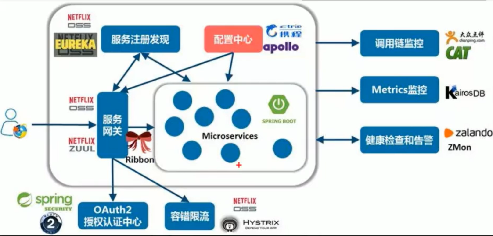

集中管理配置就要将应用的配置作为一个单独的服务抽离出来，同时要解决新的问题，比如：版本管理（为了支持回滚），权限管理等。

总结一下，在传统巨型单体应用纷纷转向细粒度微服务架构的历史进程中，配置中心是微服务化不可缺少的一个系统组件，在这种背景下中心化的配置服务即配置中心应运而生，一个合格的配置中心需要满足：

- 配置项容易读取和修改
- 添加新配置简单直接
- 支持对配置的修改的检视以把控风险
- 可以查看配置修改的历史记录
- 不同部署环境支持隔离

## ✅3.主流的配置中心

目前市面上用的比较多的配置中心有：（按开源时间排序）

1. Disconf
  2014年7月百度开源的配置管理中心，专注于各种「分布式系统配置管理」的「通用组件」和「通用平台」,提供统一的「配置管理服务」。目前已经不再维护更新。
  https://github.com/knightliao/disconf
2. Spring Cloud Config
  2014年9月开源，Spring Cloud 生态组件，可以和Spring Cloud体系无缝整合。
  https://github.com/spring-cloud/spring-cloud-config
3. Apollo
  2016年5月，携程开源的配置管理中心，能够集中化管理应用不同环境、不同集群的配置，配置修改后能够实时推送到应用端，并且具备规范的权限、流程治理等特性，适用于微服务配置管理场景。
  https://github.com/ctripcorp/apollo

4. Nacos

​	2018年6月，阿里开源的配置中心，也可以做DNS和RPC的服务发现。

​	https://github.com/alibaba/nacos


**功能特性对比**：

由于Disconf不再维护，下面主要对比一下Spring Cloud Config、Apollo和Nacos。

| 功能点            | Spring Cloud Config     | Apollo                     | Nacos                    |
| :---------------- | :---------------------- | :------------------------- | :----------------------- |
| **配置实时推送**  | 支持 (Spring Cloud Bus) | 支持 (HTTP长轮询1s内)      | 支持 (HTTP长轮询1s内)    |
| **版本管理**      | 支持 (Git)              | 支持                       | 支持                     |
| **配置回滚**      | 支持 (Git)              | 支持                       | 支持                     |
| **灰度发布**      | 支持                    | 支持                       | 1.1.0 起支持             |
| **权限管理**      | 支持 (依赖Git)          | **完善** (环境/配置级权限) | 1.2.0 起提供基础支持     |
| **多集群**        | 支持                    | 支持                       | 支持                     |
| **多环境**        | 支持                    | 支持                       | 支持                     |
| **监听查询**      | 支持                    | 支持                       | 支持                     |
| **多语言**        | 只支持Java              | 主流语言，提供了Open API   | 主流语言，提供了Open API |
| **配置格式校验**  | **不支持**              | 支持                       | 支持                     |
| **单机读 (QPS)**  | 7 (限流所致)            | 9000                       | 15000                    |
| **单机写 (QPS)**  | 5 (限流所致)            | 1100                       | 1800                     |
| **3节点读 (QPS)** | 21 (限流所致)           | 27000                      | 45000                    |
| **3节点写 (QPS)** | 5 (限流所致)            | 3300                       | 5600                     |

在此之前，Apollo和Nacos相对于Spring Cloud Config的生态支持更广，在配置管理流程上做的更好。Apollo相对于Nacos在配置管理做的更加全面，Nacos则使用起来相对比较简洁，在对性能要求比较高的大规模场景更适合。

但是在当前2025年的选型天平已明显向 **Nacos** 倾斜，特别是对于新项目和技术栈选型阶段。它在一体化能力、性能、易用性和社区活性方面取得了较好的平衡。而 **Apollo** 则在需要极致配置治理的特定领域保持着不可替代的优势。


## ✅4.Apollo介绍


> **Apollo - A reliable configuration management system**（一个可靠的配置管理系统）
>
> 开源地址：https://github.com/ctripcorp/apollo

Apollo（阿波罗）是携程框架部门研发的分布式配置中心。

- 能够集中化管理应用的不同环境、不同集群的配置，配置修改后能够实时推送到应用端。

- 并且具备规范的权限、流程治理等特性，适用于微服务配置管理场景。

Apollo包括**服务端**和**客户端**两部分：

- 服务端基于Spring Boot和Spring Cloud开发，打包后可以直接运行，不需要额外安装Tomcat等应用容器。

- Java客户端不依赖任何框架，能够运行于所有Java运行时环境，同时对Spring/Spring Boot环境也有较好的支持。


## ✅5.Apollo特性

基于配置的特殊性，Apollo从设计之初就立志于成为一个有治理能力的配置发布平台，目前提供了以下的特性：

- **统一管理不同环境、不同集群的配置**

  - 提供了一个统一界面集中式管理不同环境（environment）、不同集群（cluster）、不同命名空间（namespace）的配置。

  - 同一份代码部署在不同的集群，可以有不同的配置，比如zookeeper的地址等。

  - 通过命名空间（namespace）可以很方便地支持多个不同应用共享同一份配置，同时还允许应用对共享的配置进行覆盖。

- **配置修改实时生效（热发布）**
  - 用户在Apollo修改完配置并发布后，客户端能实时（1秒）接收到最新的配置，并通知到应用程序。

- **版本发布管理**
  - 所有的配置发布都有版本概念，从而可以方便地支持配置的回滚。

- **灰度发布**

- 支持配置的灰度发布，比如点了发布后，只对部分应用实例生效，等观察一段时间没问题后再推给所有应用实例。

- **权限管理、发布审核、操作审计**

  - 有完善的权限管理机制，对配置的管理还分为了编辑和发布两个环节，从而减少人为的错误。

  - 所有的操作都有审计日志，可以方便地追踪问题。

- **客户端配置信息监控**

  - 可以在界面上方便地看到配置在被哪些实例使用。

  - 提供Java和.Net原生客户端，方便应用集成。
  - 支持Spring Placeholder, Annotation和Spring Boot的ConfigurationProperties，方便应用使用（需要Spring 3.1.1+）
  - 同时提供了Http接口，非Java和.Net应用也可以方便地使用。

- **提供开放平台API**

  - Apollo自身提供了比较完善的统一配置管理界面，支持多环境、多数据中心配置管理、权限、流程治理等特性。不过Apollo出于通用性考虑，不会对配置的修改做过多限制，只要符合基本的格式就能保存，不会针对不同的配置值进行针对性的校验，如数据库用户名、密码，Redis服务地址等。
  - 对于这类应用配置，Apollo支持应用方通过开放平台API在Apollo进行配置的修改和发布，并且具备完善的授权和权限控制。


# 📖2.Apollo快速入门

## ✅1.执行流程

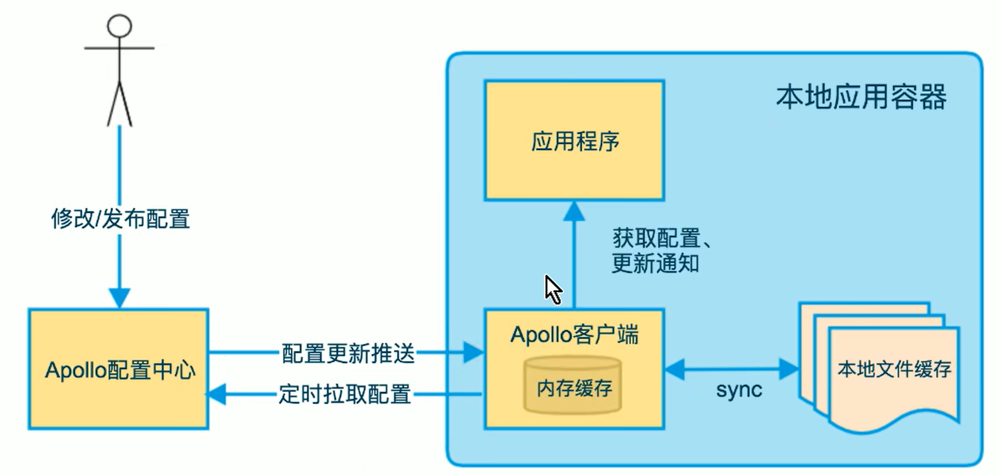

操作流程如下：

- 1.在Apollo配置中心修改配置

- 2.应用程序通过Apollo客户端从配置中心拉取配置信息

用户通过Apollo配置中心修改或发布配置后，会有两种机制来保证应用程序来获取最新配置：一种是Apollo配置中心会向客户端推送最新的配置；另外一种是Apollo客户端会定时从Apollo配置中心拉取最新的配置，通过以上两种机制共同来保证应用程序能及时获取到配置。

## ✅2.安装Apollo

> 运行时环境说明：
> Java
>
> - Apollo服务端：1.8+
> - Apollo客户端：1.8+
>
> MySQL
>
> - 版本要求：5.6.5+
>
> Apollo的表结构对 `timestamp` 使用了多个default声明，所以需要5.6.5以上版本。

### 🧊1.下载配置

- 百度云盘链接: https://pan.baidu.com/s/1RzNTnvNyhio_nm61YVTP5Q 提取码: e3hq 

- 也可在github主页获取安装包（本次使用1.3版本）：https://github.com/ctripcorp/apollo/tags

下载1.3.0版本，可以直接访问https://github.com/apolloconfig/apollo/releases/tag/v1.3.0

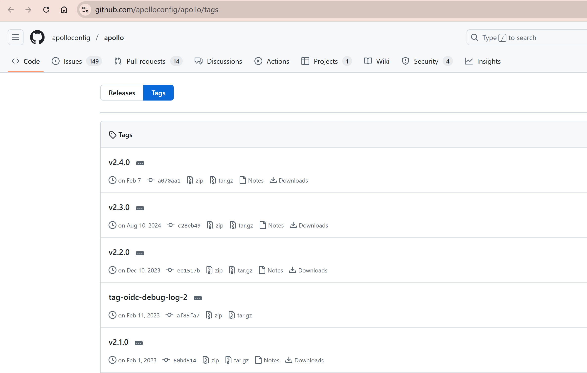

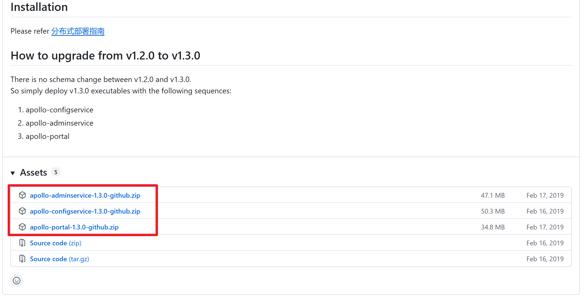

解压安装包后将apollo-configservice-1.3.0.jar、apollo-adminservice-1.3.0.jar、apollo-portal-1.3.0.jar放置于apollo目录下。

如果下载百度云盘资料，则如下图

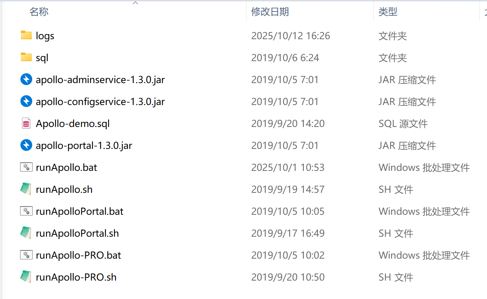


### 🧊2.创建数据库

Apollo服务端共需要两个数据库： **ApolloPortalDB** 和 **ApolloConfigDB** ，ApolloPortalDB只需要在生产环境部署一个即可，**而ApolloConfigDB需要在每个环境部署一套。**

1. 创建ApolloPortalDB，sql脚本下载地址：

   https://github.com/apolloconfig/apollo/blob/v1.3.0/scripts/db/migration/portaldb/V1.0.0__initialization.sql

   以MySQL原生客户端为例：

   ```sql
   source apollo/ApolloPortalDB__initialization.sql
   ```

2. 创建ApolloConfigDB，sql脚本下载地址:

   https://github.com/ctripcorp/apollo/blob/v1.3.0/scripts/db/migration/configdb/V1.0.0__initialization.sql

   ```sql
   source apollo/ApolloConfigDB__initialization.sql
   ```


### 🧊3.启动Apollo

1. 确保**8070, 8080, 8090**端口未被占用，Apollo默认会启动3个服务。

2. 启动apollo-configservice，在apollo目录下执行如下命令，可通过-Dserver.port=8080修改默认端口

   ```java
   java -Xms256m -Xmx256m -Dspring.datasource.url=jdbc:mysql://localhost:3306/ApolloConfigDB?characterEncoding=utf8 -Dspring.datasource.username=root -Dspring.datasource.password=admin -jar apollo-configservice-1.3.0.jar
   ```

3. 启动apollo-adminservice，可通过-Dserver.port=8090修改默认端口

   ```java
   java -Xms256m -Xmx256m -Dspring.datasource.url=jdbc:mysql://localhost:3306/ApolloConfigDB?characterEncoding=utf8 -Dspring.datasource.username=root -Dspring.datasource.password=admin -jar apollo-adminservice-1.3.0.jar
   ```

4. 启动apollo-portal，可通过-Dserver.port=8070修改默认端口

   ```
   java -Xms256m -Xmx256m -Ddev_meta=http://localhost:8080/ -Dserver.port=8070 -Dspring.datasource.url=jdbc:mysql://localhost:3306/ApolloPortalDB?characterEncoding=utf8 -Dspring.datasource.username=root -Dspring.datasource.password=admin -jar apollo-portal-1.3.0.jar
   ```

5. 也可以使用提供的runApollo.bat快速启动三个服务（修改数据库连接地址，数据库以及密码）

   ```bash
   echo
   
   set url="localhost:3306"
   set username="root"
   set password="admin"
   
   start "configService" java -Xms256m -Xmx256m -Dapollo_profile=github -Dspring.datasource.url=jdbc:mysql://%url%/ApolloConfigDB?characterEncoding=utf8 -Dspring.datasource.username=%username% -Dspring.datasource.password=%password% -Dlogging.file=.\logs\apollo-configservice.log -jar .\apollo-configservice-1.3.0.jar
   start "adminService" java -Xms256m -Xmx256m -Dapollo_profile=github -Dspring.datasource.url=jdbc:mysql://%url%/ApolloConfigDB?characterEncoding=utf8 -Dspring.datasource.username=%username% -Dspring.datasource.password=%password% -Dlogging.file=.\logs\apollo-adminservice.log -jar .\apollo-adminservice-1.3.0.jar
   start "ApolloPortal" java -Xms256m -Xmx256m -Dapollo_profile=github,auth -Ddev_meta=http://localhost:8080/ -Dserver.port=8070 -Dspring.datasource.url=jdbc:mysql://%url%/ApolloPortalDB?characterEncoding=utf8 -Dspring.datasource.username=%username% -Dspring.datasource.password=%password% -Dlogging.file=.\logs\apollo-portal.log -jar .\apollo-portal-1.3.0.jar
   ```

   

6. 运行runApollo.bat即可同时启动三个服务，一键启动Apollo

7. 待启动成功后，访问管理页面 apollo/admin

   - 地址：http://localhost:8070

   - 初始化账号密码：apollo/admin

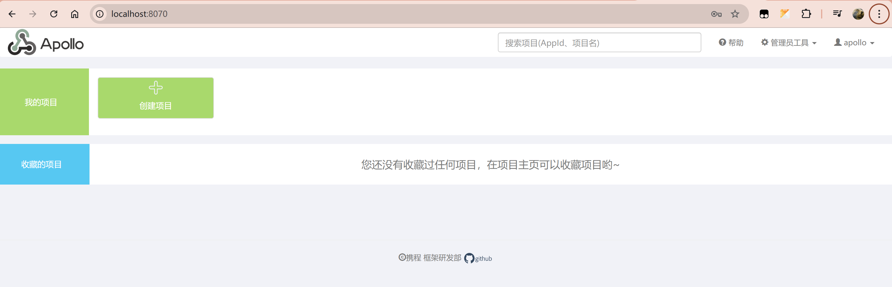

## ✅3.代码实现

### 🧊1.发布配置

1. 在apollo管理界面，新建项目apollo-quickstart

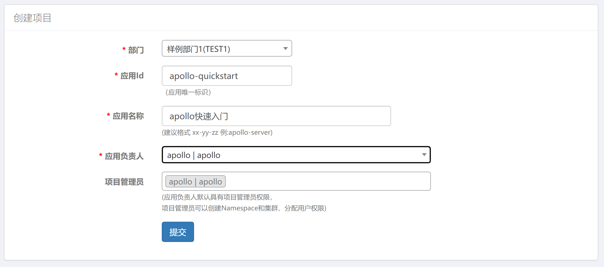

2.新建测试配置项sms.enable

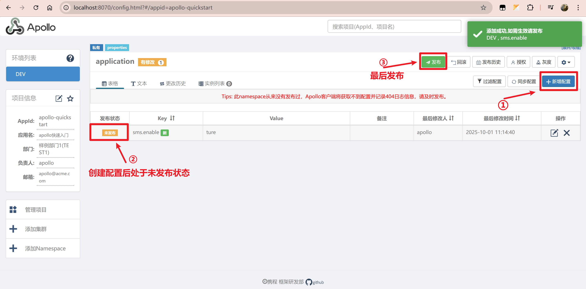

确认提交配置项即可添加

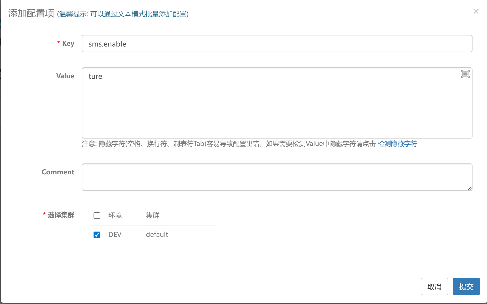

发布前value值错误可以在操作栏进行修改后再发布，发布完后状态会更新为已发布。

### 🧊2.代码读取配置	

1.新建Maven工程

使用idea创建apollo-quickstart项目

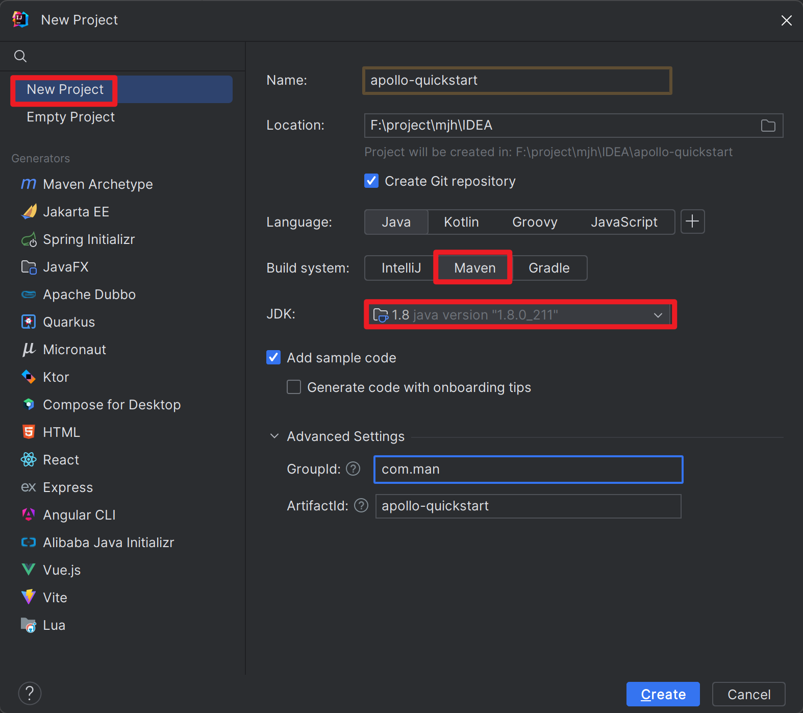

打开pom.xml文件添加apollo依赖，配置JDK为1.8

```java
<?xml version="1.0" encoding="UTF-8"?>
<project xmlns="http://maven.apache.org/POM/4.0.0"
         xmlns:xsi="http://www.w3.org/2001/XMLSchema-instance"
         xsi:schemaLocation="http://maven.apache.org/POM/4.0.0 http://maven.apache.org/xsd/maven-4.0.0.xsd">
    <modelVersion>4.0.0</modelVersion>

    <groupId>com.man</groupId>
    <artifactId>apollo-quickstart</artifactId>
    <version>1.0-SNAPSHOT</version>

    <properties>
        <java.version>1.8</java.version>
    </properties>
    <dependencies>
        <!--1.apollo-client-->
        <dependency>
            <groupId>com.ctrip.framework.apollo</groupId>
            <artifactId>apollo-client</artifactId>
            <version>1.1.2</version>
        </dependency>
        <!--slf4j-simple-->
        <dependency>
            <groupId>org.slf4j</groupId>
            <artifactId>slf4j-simple</artifactId>
            <version>2.0.0</version>
            <scope>test</scope>
        </dependency>
    </dependencies>
    <build>
        <plugins>
            <plugin>
                <groupId>org.apache.maven.plugins</groupId>
                <artifactId>maven-compiler-plugin</artifactId>
                <configuration>
                    <source>8</source>
                    <target>8</target>
                    <encoding>UTF-8</encoding>
                </configuration>
            </plugin>
        </plugins>
    </build>

</project>
```

2.编写测试类GetConfigTest，添加如下代码读取sms.enable的值

```java
public class GetConfigTest {
    // VM options:
	// ‐Dapp.id=apollo‐quickstart ‐Denv=DEV ‐Ddev_meta=http://localhost:8080
    public static void main(String[] args) {
        Config config = ConfigService.getAppConfig();
        String someKey = "sms.enable";
        String value = config.getProperty(someKey, null);
        System.out.println("sms.enable: " + value);
    }
}
```

3.测试

配置VM options，设置系统属性：

```
‐Dapp.id=apollo‐quickstart ‐Denv=DEV ‐Ddev_meta=http://localhost:8080
```

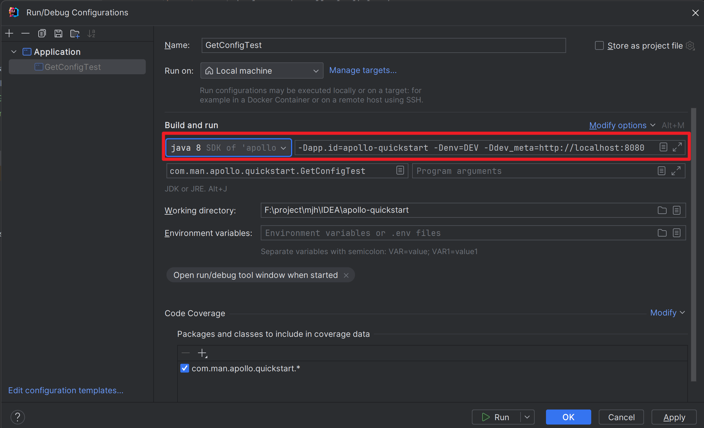

运行GetConfigTest，打开控制台，观察输出结果。

还可测试，修改apollo界面的配置值sms.enable，true改成false，发布后再运行看结果

### 🧊3.热发布

1. 修改代码为每3秒获取一次

```java
public class GetConfigTest {
    public static void main(String[] args) throws InterruptedException {
        Config config = ConfigService.getAppConfig();
        String someKey = "sms.enable";
        while (true) {
            String value = config.getProperty(someKey, null);
            System.out.printf("now: %s, sms.enable: %s%n", LocalDateTime.now().toString(),
                    value);
            Thread.sleep(3000L);
        }
    }
}
```

2.在Apollo管理界面修改配置项，可以看到程序获取的sms.enable的值已由false变成了修改后的true

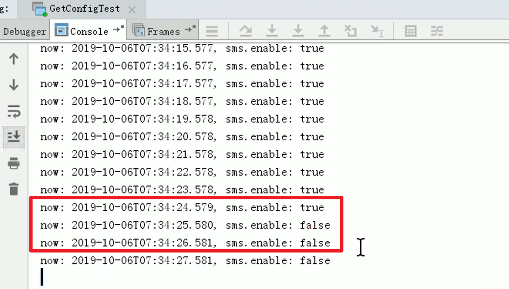

# 📖3.Apollo应用

## ✅1.Apollo工作原理

下图是Apollo架构模块的概览

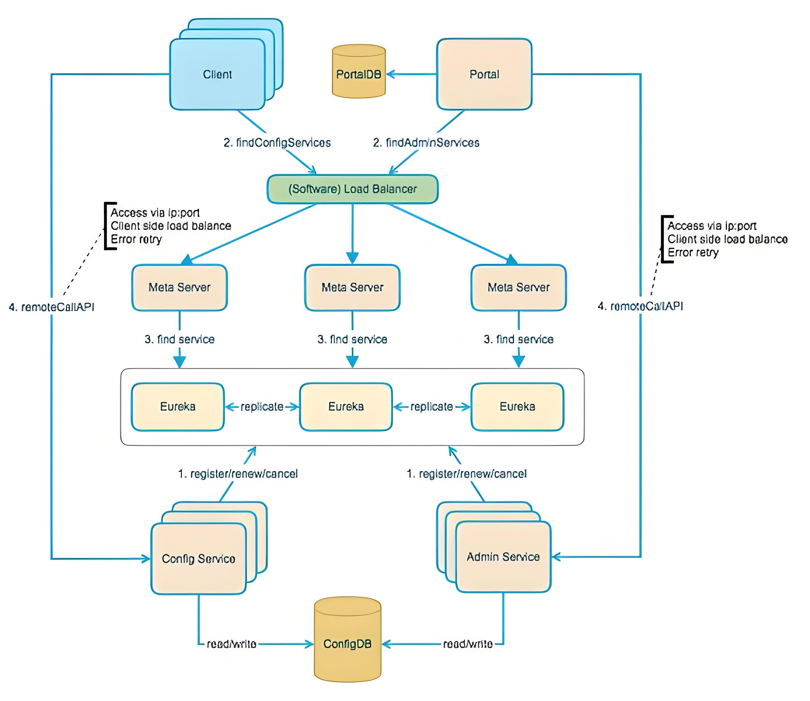

**各模块职责**
上图简要描述了Apollo的总体设计，我们可以从下往上看：

- Config Service提供配置的读取、推送等功能，服务对象是Apollo客户端。
- Admin Service提供配置的修改、发布等功能，服务对象是Apollo Portal（管理界面）。
- Eureka提供服务注册和发现，为了简单起见，目前Eureka在部署时和Config Service是在一个JVM进程中的。
- Config Service和Admin Service都是多实例、无状态部署，所以需要将自己注册到Eureka中并保持心跳
- 在Eureka之上架了一层Meta Server用于封装Eureka的服务发现接口。
- Client通过域名访问Meta Server获取Config Service服务列表（IP+Port），而后直接通过IP+Port访问服务，同时在Client侧会做loadbalance、错误重试。
- Portal通过域名访问Meta Server获取Admin Service服务列表（IP+Port），而后直接通过IP+Port访问服务，同时在Portal侧会做loadbalance、错误重试。
- 为了简化部署，我们实际上会把Config Service、Eureka和Meta Server三个逻辑角色部署在同一个JVM进程中。

**分步执行流程**

1. Apollo启动后，Config/Admin Service会自动注册到Eureka服务注册中心，并定期发送保活心跳。
2. Apollo Client和Portal管理端通过配置的Meta Server的域名地址经由Software Load Balancer(软件负载均衡器)进行负载均衡后分配到某一个Meta Server。
3. Meta Server从Eureka获取Config Service和Admin Service的服务信息，相当于是一个Eureka Client。
4. Meta Server获取Config Service和Admin Service（IP+Port）失败后会进行重试。
5. 获取到正确的Config Service和Admin Service的服务信息后，Apollo Client通过Config Serv。ice为应用提供配置获取、实时更新等功能；Apollo Portal管理端通过Admin Service提供配置新增、修改、发布等功能。

## ✅2.核心概念

1. application (应用)
  这个很好理解，就是实际使用配置的应用，Apollo客户端在运行时需要知道当前应用是谁，从而可以去获取
  对应的配置
  关键字：appId
2. environment (环境)
  配置对应的环境，Apollo客户端在运行时需要知道当前应用处于哪个环境，从而可以去获取应用的配置
  关键字：env
3. cluster (集群)
  一个应用下不同实例的分组，比如典型的可以按照数据中心分，把上海机房的应用实例分为一个集群，把北
  京机房的应用实例分为另一个集群。
  关键字：cluster
4. namespace (命名空间)
  一个应用下不同配置的分组，可以简单地把namespace类比为文件，不同类型的配置存放在不同的文件中，
  如数据库配置文件，RPC配置文件，应用自身的配置文件等
  关键字：namespaces

它们的关系如下图所示：


## ✅3.项目管理

### 🧊1.基础设置

- 部门管理
- 添加用户

1.apollo 默认部门有两个。要增加自己的部门，可在系统参数中修改：

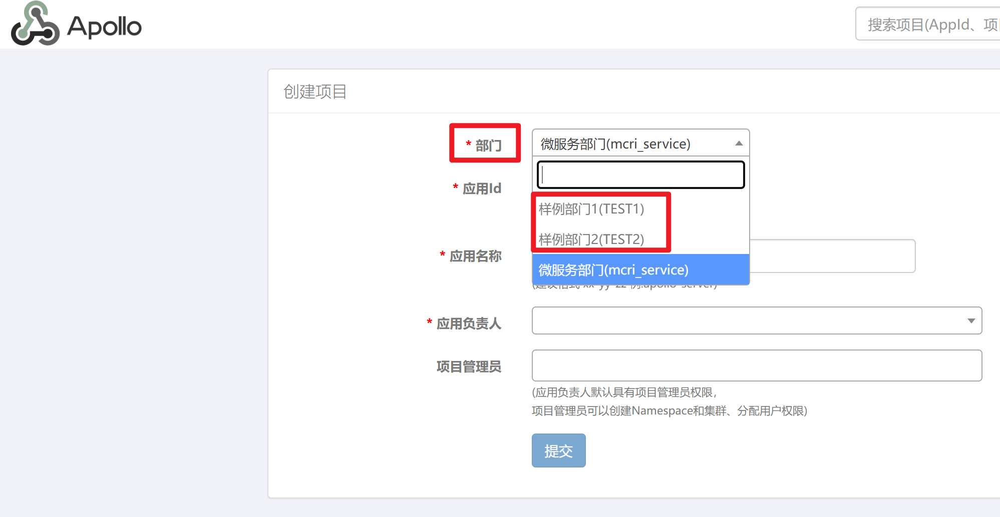

进入系统参数设置，输入key查询已存在的部门设置：organizations

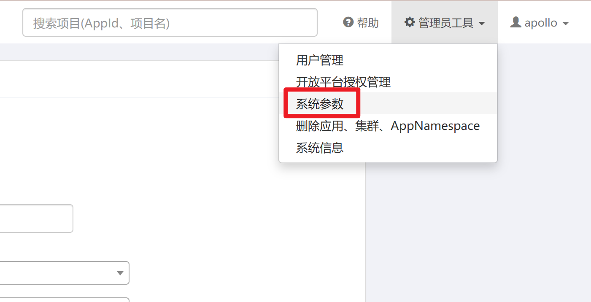

查询出来后，在value中修改并添加一个json组即可。

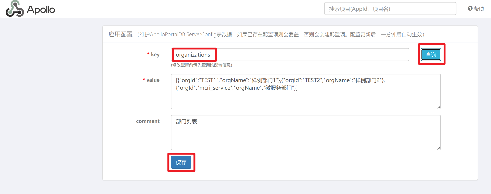

2. 添加用户：apollo默认提供一个超级管理员: apollo，可以自行添加用户

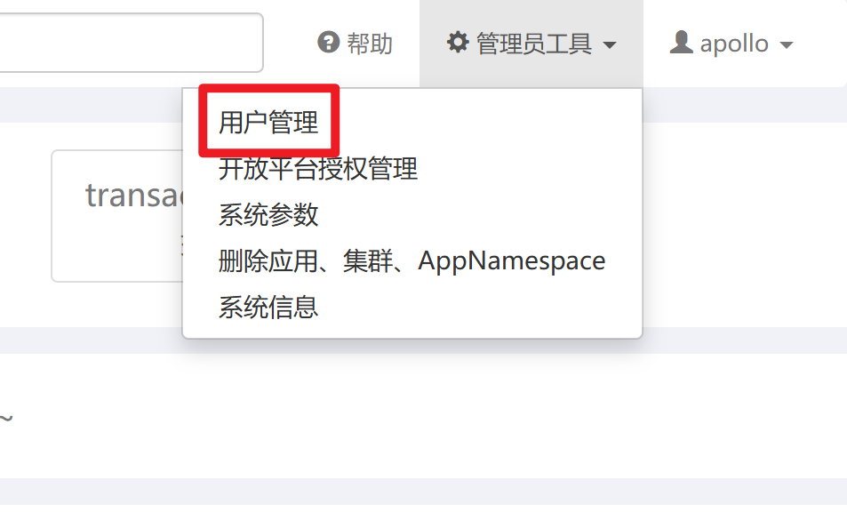

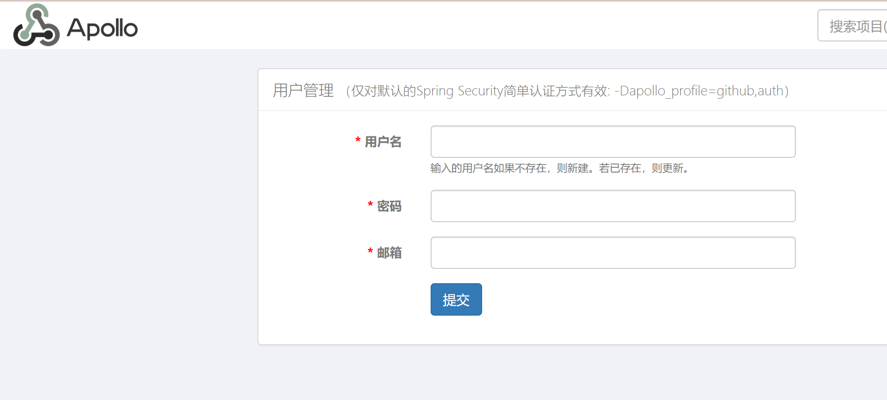

### 🧊2.创建项目

1. 打开apollo-portal主页：http://localhost:8070/
2. 点击“创建项目”：account-service
3. 输入项目信息
   - 部门：选择应用所在的部门。
   - 应用AppId：用来标识应用身份的唯一id，格式为string，需要和项目配置文件applications.properties中配置的app.id对应。
   - 应用名称：应用名，仅用于界面展示。
   - 应用负责人：选择的人默认会成为该项目的管理员，具备项目权限管理、集群创建、Namespace创建等权限。

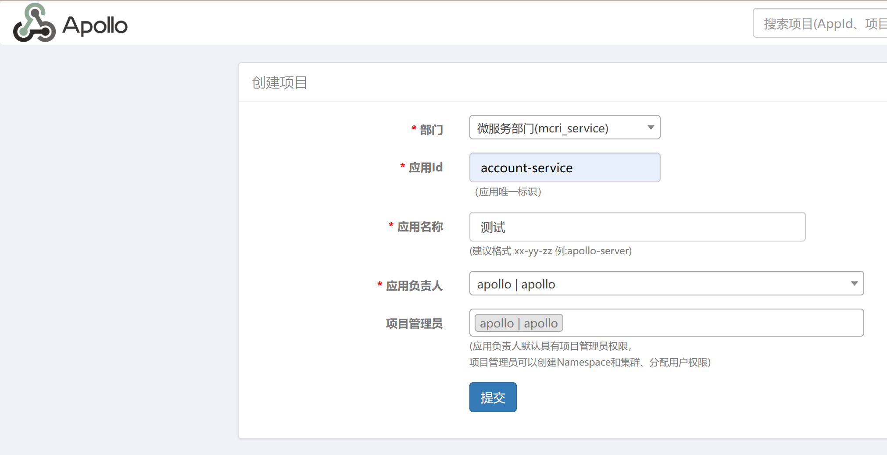

点击提交，创建成功后，会自动跳转到项目首页。

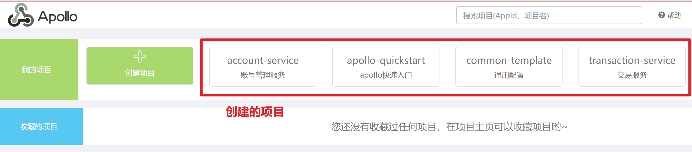

4. 赋予其他用户权限来管理这个account-service服务
   - 使用管理员apollo，进入指定项目并授权给其他用户

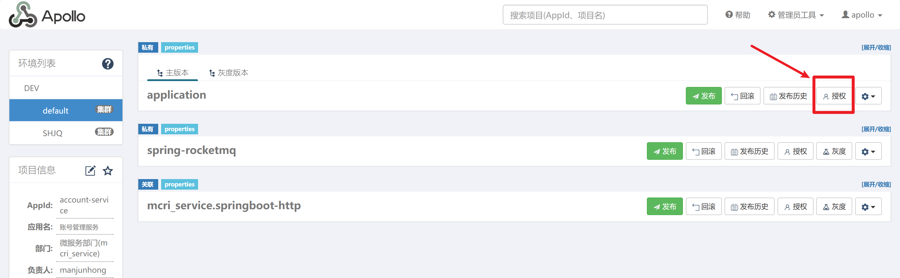

将修改和发布权限都授权给用户man

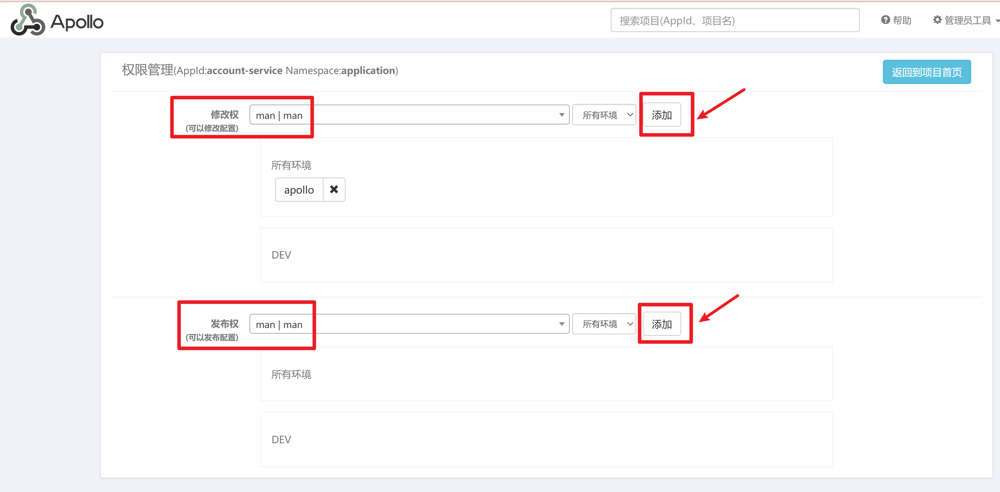

最后使用man登录，查看项目配置权限是否生效。


### 🧊3.删除项目

如果要删除整个项目，点击右上角的“管理员工具-->删除应用、集群...”
首先查询出要删除的项目，点击“删除应用”

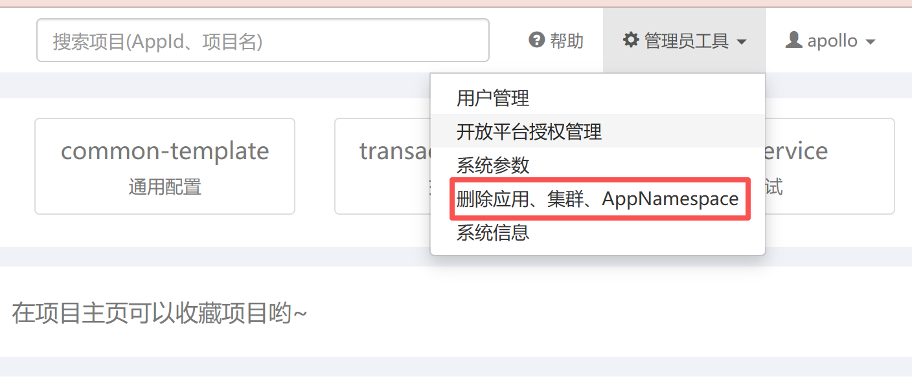

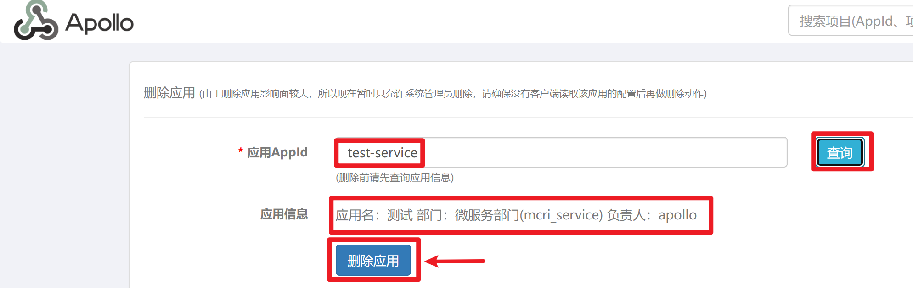


## ✅4.配置管理

### 🧊1.添加发布配置项

1. 通过表格模式添加配置
   - 输入key-vlue值提交即可

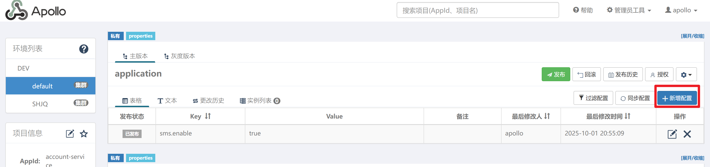

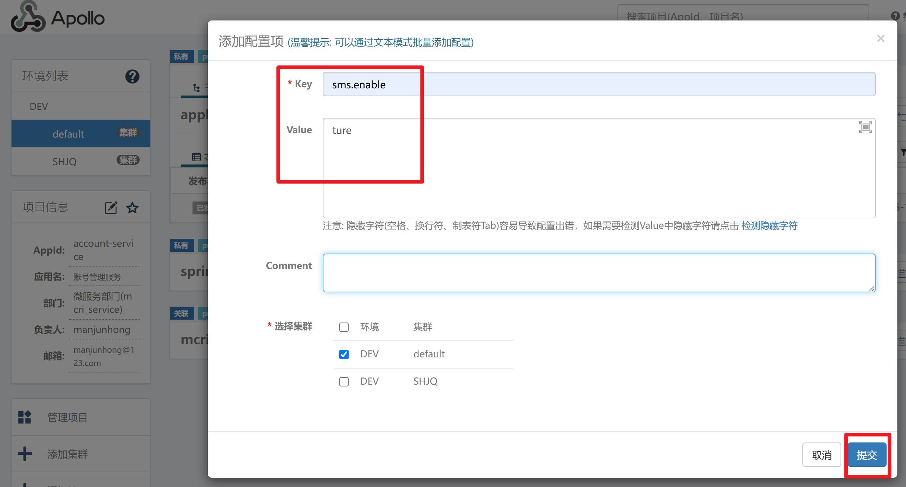

2. 通过文本模式编辑
   - 这种方式可以将项目的配置复制过来批量导入

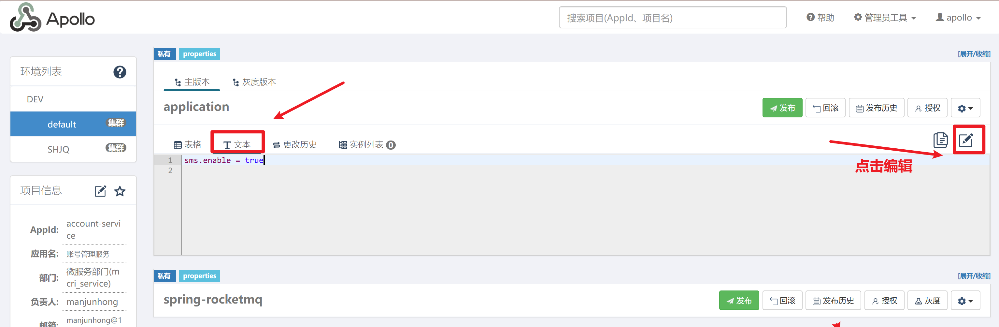

3. 发布配置

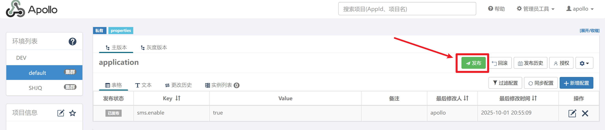

### 🧊2.修改删除配置

1. 找到对应的配置项，点击修改或者删除操作

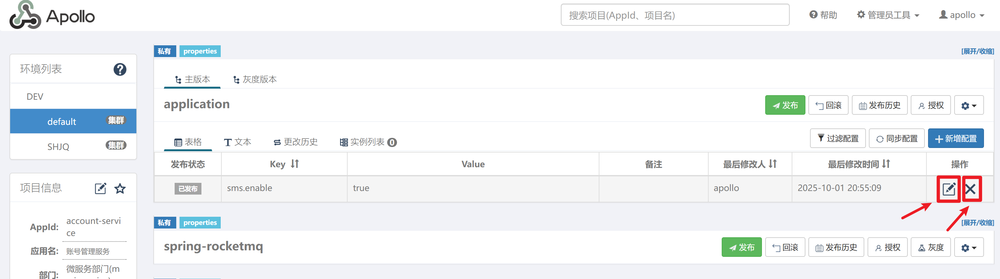

2. 修改为需要的值，点击提交
3. 发布配置


### 🧊3.添加Namespace

Namespace作为配置的分类，可当成一个配置文件。

以添加rocketmq配置为例，添加“spring-rocketmq” Namespace配置rocketmq相关信息。

1. 添加项目私有Namespace：spring-rocketmq

进入项目首页，点击左下脚的“添加Namespace”，共包括两项：关联公共Namespace和创建Namespace，

这里选择“创建Namespace”

### 🧊4.公共配置


## 5 多项目配置

## 6 集群管理

1 创建集群 

2 同步集群配置

3 读取配置

## 7 配置发布原理

# Apollo应用于分布式系统

## 1 项目场景介绍

## 2 Spring Boot应用集成


## 4 生产环境部署


## 5 灰度发布

